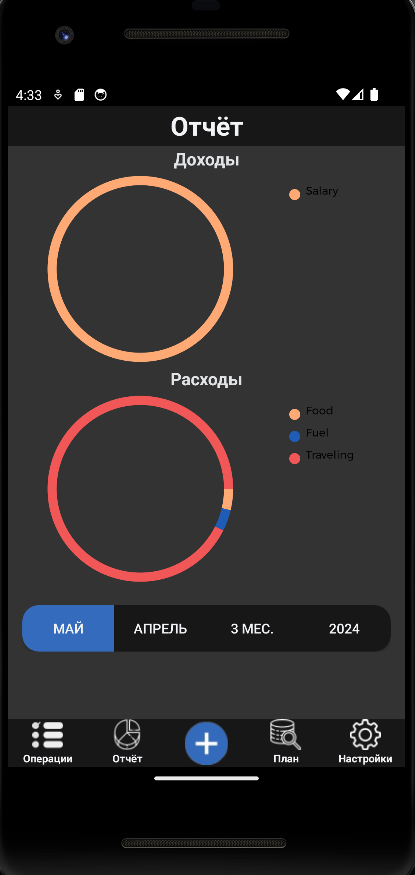

# Мобильное приложение WealthFamily
## Остальная часть проекта, выполненная нашей командой находится в репозитории: https://github.com/Codepairs/wf
### Учебный проект по предмету "Операционные системы"

#### Приложение написано на языке програмирования Kotlin (версия 1.9.0)

## Краткий user guide:

* ### Зайдя первый раз в приложение попадём на страницу регистрации: 
 
 ### Зарегистрироваться дважды с одной почты нельзя
* ### Пройдя регистрацию попадаем на страницу входа в приложение:
  
  
* ### После входа в приложение необходимо придумать PIN-код для входа в приложения без регистрации:
  
* ### Затем его надо будет подтвердить:
  
* ### Далее пользователя перекидывет на главную страницу приложения: 
  
* ### На главной странице есть навигационная панель, с помощью которой можно перемещаться по приложению
* ### На странице настроек можно выбрать тему оформления приложения (тёмную или светлую), также можно выбрать язык (русский или английский), сменить PIN-код или выйти из профиля 
  
  
  
* ### Также кроме основной страницы с круговыми диаграммами есть страница с таблицей всех расходов и доходов:
  
* ### При долгом нажатии на расход/доход появится окно, где можно изменить доход/расход (поменять параметр(ы) и нажать на задний фон) или удалить его, нажав на кнопку удаления:
  
* ### Соответственно доходы/расходы можно добавлять. Это можно сделать нажав на кнопку с "плюсом" в середине навигационной панели. При нжатии, пользователя перекидывает на страницу, где соответственно добавляются доходы/расходы.
  
### В данном разделе есть два необязательных к заполнению поля: тип дохода/расхода и получатель. Если не ввести что-то из остального, то программа не пропустит пользователя к даленейшим действиям.
* ### Также на навигационной панели есть раздел плана, который не функционирует, т.к. в API сервера пока не прописано взаимодействие с ним